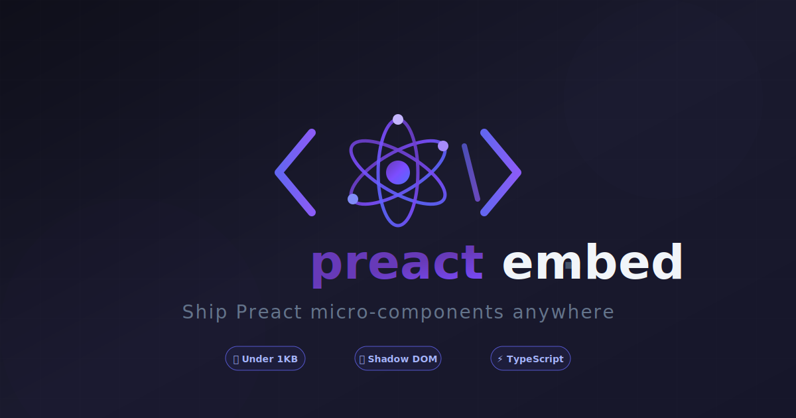

<p align="center">
  
</p>

<h1 align="center">preact-embed</h1>

<p align="center">
  <strong>🚀 Ship Preact micro-components anywhere. Zero config. Under 1KB.</strong>
</p>

<p align="center">
  <a href="https://www.npmjs.com/package/preact-embed"></a>
  <a href="https://bundlephobia.com/package/preact-embed"></a>
  <a href="https://github.com/user/preact-embed/blob/main/LICENSE"></a>
  <a href="https://www.npmjs.com/package/preact-embed"></a>
</p>

<p align="center">
  <a href="#-features">Features</a> •
  <a href="#-quick-start">Quick Start</a> •
  <a href="#-examples">Examples</a> •
  <a href="#-api">API</a> •
  <a href="#-why-preact-embed">Why?</a>
</p>

<br />

<p align="center">
  
</p>

---

## ✨ Features

<table>
<tr>
<td width="50%">

### 🪶 Impossibly Lightweight
**Under 1KB** min+gzip. Your widget code will be bigger than the framework.

### 🔒 Shadow DOM Isolation  
Optional style encapsulation. Your CSS stays in, theirs stays out.

### 🦥 Lazy Loading
Defer rendering until visible with IntersectionObserver. Ship fast, load smart.

</td>
<td width="50%">

### 🧩 Web Components
Register as native Custom Elements. Works everywhere, no framework required.

### ⚡ Signals Ready
Optional `@preact/signals` integration for reactive cross-widget state.

### 💧 SSR Hydration
First-class server-rendering support. Fast to paint, fast to interact.

</td>
</tr>
</table>

---

## 📦 Installation

```bash
npm install preact-embed preact
```

```bash
yarn add preact-embed preact
```

```bash
pnpm add preact-embed preact
```

---

## 🚀 Quick Start

### 1. Create your widget

```tsx
// widgets/PricingCard.tsx
import { h } from 'preact';
import { useState } from 'preact/hooks';

interface Props {
  plan?: string;
  price?: number;
  features?: string[];
}

export function PricingCard({ plan = 'Pro', price = 29, features = [] }: Props) {
  const [selected, setSelected] = useState(false);
  
  return (
    <div className="pricing-card">
      <h2>{plan}</h2>
      <p className="price">${price}/mo</p>
      <ul>
        {features.map(f => <li key={f}>{f}</li>)}
      </ul>
      <button onClick={() => setSelected(!selected)}>
        {selected ? '✓ Selected' : 'Choose Plan'}
      </button>
    </div>
  );
}
```

### 2. Create the embed

```tsx
// index.tsx
import embed from 'preact-embed';
import { PricingCard } from './widgets/PricingCard';

const { render } = embed(PricingCard);

render({
  selector: '[data-widget="pricing"]',
  defaultProps: {
    plan: 'Starter',
    price: 9,
  },
});
```

### 3. Drop it anywhere

```html
<!-- On any website, CMS, or app -->
<div 
  data-widget="pricing"
  data-prop-plan="Enterprise"
  data-prop-price="99"
>
  <script type="application/json">
    {
      "features": ["Unlimited users", "Priority support", "Custom integrations"]
    }
  </script>
</div>

<script src="https://cdn.example.com/pricing-widget.js" async></script>
```

**That's it.** Your Preact component now runs anywhere. 🎉

---

## 🎯 Examples

<details>
<summary><strong>📍 Basic Selector Mount</strong></summary>

```tsx
import embed from 'preact-embed';
import { NewsletterForm } from './NewsletterForm';

const { render } = embed(NewsletterForm);

render({
  selector: '#newsletter-signup',
});
```

```html
<div id="newsletter-signup"></div>
```

</details>

<details>
<summary><strong>🔐 Shadow DOM Isolation</strong></summary>

Perfect for third-party embeds where you can't control the host page's CSS.

```tsx
render({
  selector: '[data-widget="checkout"]',
  shadowRoot: true,  // Styles won't leak in or out
});

// Or with options
render({
  selector: '[data-widget="checkout"]',
  shadowRoot: { mode: 'closed' },  // Extra privacy
});
```

</details>

<details>
<summary><strong>🦥 Lazy Loading</strong></summary>

Only load widgets when they scroll into view.

```tsx
render({
  selector: '.below-the-fold-widget',
  lazy: true,  // Uses IntersectionObserver
});

// With custom threshold
render({
  selector: '.below-the-fold-widget',
  lazy: {
    threshold: 0.5,      // 50% visible before loading
    rootMargin: '100px', // Start loading 100px before visible
  },
});
```

</details>

<details>
<summary><strong>🧩 Custom Elements (Web Components)</strong></summary>

Register your widget as a native HTML element.

```tsx
import embed from 'preact-embed';
import { VideoPlayer } from './VideoPlayer';

const { render } = embed(VideoPlayer);

render({
  tagName: 'x-video-player',  // Registers <x-video-player>
  shadowRoot: true,
});
```

```html
<!-- Now use it like native HTML! -->
<x-video-player 
  src="https://example.com/video.mp4"
  autoplay="false"
  poster="thumbnail.jpg"
></x-video-player>
```

</details>

<details>
<summary><strong>💧 SSR Hydration</strong></summary>

Hydrate server-rendered markup instead of replacing it.

```tsx
render({
  selector: '[data-widget="comments"]',
  hydrate: true,  // Attaches to existing DOM
});
```

</details>

<details>
<summary><strong>📡 Cross-Widget Communication</strong></summary>

Widgets can talk to each other through the event bus.

```tsx
// Widget A: User Selector
import { eventBus } from 'preact-embed';

function UserSelector() {
  const selectUser = (user) => {
    eventBus.emit('user:selected', user);
  };
  // ...
}

// Widget B: User Profile (different widget, same page)
import { useHabitatEvent } from 'preact-embed';

function UserProfile() {
  const [user] = useHabitatEvent('user:selected');
  
  return user ? <Profile user={user} /> : <p>Select a user</p>;
}
```

</details>

<details>
<summary><strong>⚡ Signals Integration</strong></summary>

Share reactive state across widgets without prop drilling.

```tsx
// Install: npm install @preact/signals
import { getSignal, createStore } from 'preact-embed/signals';

// Global reactive counter (accessible from any widget)
const count = getSignal('cart-count', 0);

function AddToCartButton({ productId }) {
  const addToCart = () => {
    count.value++;
    // All widgets using this signal will update!
  };
  
  return <button onClick={addToCart}>Add to Cart ({count})</button>;
}

function CartIcon() {
  return <span className="cart-badge">{count}</span>;
}
```

</details>

---

## 📖 API Reference

### `embed(Component)`

Creates an embed instance for a Preact component.

```tsx
import embed from 'preact-embed';

const { render, renderOne, unmountAll, instances } = embed(MyWidget);
```

| Return | Type | Description |
|--------|------|-------------|
| `render` | `(options) => WidgetInstance[]` | Mount to all matching elements |
| `renderOne` | `(element, props?) => WidgetInstance` | Mount to a single element |
| `unmountAll` | `() => void` | Destroy all widget instances |
| `instances` | `WidgetInstance[]` | Array of active instances |

### Render Options

```tsx
interface EmbedOptions<P> {
  // Target elements
  selector?: string;           // CSS selector to find mount points
  inline?: boolean;            // Mount in parent of <script> tag
  clientSpecified?: boolean;   // Read selector from data-mount-in attr
  
  // Props
  defaultProps?: Partial<P>;   // Default props for all instances
  
  // Rendering
  clean?: boolean;             // Clear innerHTML before mounting
  hydrate?: boolean;           // Hydrate SSR markup instead of render
  
  // Advanced
  shadowRoot?: boolean | ShadowRootInit;   // Enable Shadow DOM
  lazy?: boolean | IntersectionObserverInit;  // Lazy load on scroll
  tagName?: string;            // Register as Custom Element
  
  // Lifecycle
  onBeforeMount?: (el: Element, props: P) => void | P;
  onMounted?: (el: Element, props: P) => void;
  onUnmount?: (el: Element) => void;
}
```

### Widget Instance

```tsx
interface WidgetInstance<P> {
  element: Element;           // The mounted DOM element
  props: P;                   // Current props
  update: (props: Partial<P>) => void;  // Update props & rerender
  unmount: () => void;        // Destroy this instance
}
```

---

## 🎨 Passing Props

### Via Data Attributes

```html
<div 
  data-widget="pricing"
  data-prop-plan="Pro"
  data-prop-price="29"
  data-prop-is-popular="true"
  data-prop-discount-percent="20"
></div>
```

| Attribute | Prop | Value |
|-----------|------|-------|
| `data-prop-plan` | `plan` | `"Pro"` |
| `data-prop-price` | `price` | `29` (number) |
| `data-prop-is-popular` | `isPopular` | `true` (boolean) |
| `data-prop-discount-percent` | `discountPercent` | `20` (number) |

> **Auto-parsing:** Numbers, booleans (`true`/`false`), `null`, and JSON are automatically parsed.

### Via JSON Script

```html
<div data-widget="pricing">
  <script type="application/json">
    {
      "plan": "Enterprise",
      "price": 99,
      "features": ["SSO", "Audit logs", "99.99% SLA"],
      "contact": {
        "email": "sales@example.com",
        "phone": "1-800-EXAMPLE"
      }
    }
  </script>
</div>
```

> **Tip:** JSON props are great for arrays, objects, and complex data structures.

---

## 🏗️ Build Configuration

<details>
<summary><strong>Vite</strong></summary>

```ts
// vite.config.ts
import { defineConfig } from 'vite';
import preact from '@preact/preset-vite';

export default defineConfig({
  plugins: [preact()],
  build: {
    lib: {
      entry: 'src/index.tsx',
      name: 'MyWidget',
      formats: ['umd', 'es'],
      fileName: (format) => `widget.${format}.js`,
    },
    rollupOptions: {
      output: {
        globals: {
          preact: 'preact',
        },
      },
    },
  },
});
```

</details>

<details>
<summary><strong>Webpack</strong></summary>

```js
// webpack.config.js
module.exports = {
  entry: './src/index.tsx',
  output: {
    filename: 'widget.js',
    library: {
      name: 'MyWidget',
      type: 'umd',
    },
    globalObject: 'this',
  },
  // ... rest of config
};
```

</details>

<details>
<summary><strong>tsup</strong></summary>

```ts
// tsup.config.ts
import { defineConfig } from 'tsup';

export default defineConfig({
  entry: ['src/index.tsx'],
  format: ['cjs', 'esm', 'iife'],
  globalName: 'MyWidget',
  minify: true,
  dts: true,
});
```

</details>

---

## 📊 Bundle Size

| Module | Size (min+gzip) |
|--------|-----------------|
| `preact-embed` | ~1.0 KB |
| `preact-embed/signals` | ~0.5 KB |
| `preact-embed/lite` | ~0.5 KB |

Compare that to your alternatives:

| Library | Size |
|---------|------|
| **preact-embed** | **~1.0 KB** |
| preact-island | ~1.3 KB |
| preact-habitat | ~0.9 KB |
| React + ReactDOM | ~45 KB |

---

## 🤔 Why preact-embed?

### The Problem

You need to embed a Preact component into:
- A client's WordPress site
- A Shopify storefront  
- An existing jQuery app
- Any CMS or third-party website

But you can't control the build system, the CSS, or what else is on the page.

### The Solution

**preact-embed** gives you a bulletproof way to:

1. **Mount anywhere** — By selector, inline, or as a Web Component
2. **Stay isolated** — Shadow DOM keeps your styles safe
3. **Load smart** — Lazy loading for below-the-fold widgets
4. **Communicate** — Event bus and Signals for multi-widget pages
5. **Stay tiny** — Under 1KB, so Preact itself is your biggest dependency

---

## 🔄 Migration from preact-habitat

Already using preact-habitat? The API is nearly identical:

```diff
- import habitat from 'preact-habitat';
+ import embed from 'preact-embed';

- const { render } = habitat(MyWidget);
+ const { render } = embed(MyWidget);

  render({
    selector: '.my-widget',
+   // New features available:
+   shadowRoot: true,
+   lazy: true,
  });
```

---

## 🌐 Browser Support

| Browser | Version |
|---------|---------|
| Chrome | 60+ |
| Firefox | 55+ |
| Safari | 12+ |
| Edge | 79+ |

> **Note:** For IE11 or older browsers, you'll need polyfills for `IntersectionObserver` (lazy loading) and `customElements` (Web Components).

---

## 🤝 Contributing

Contributions are welcome! Please read our [Contributing Guide](CONTRIBUTING.md) first.

```bash
# Clone the repo
git clone https://github.com/openconjecture/preact-embed.git

# Install dependencies
pnpm install

# Run tests
pnpm test

# Build
pnpm build
```

---

## 📄 License

MIT © [Garrett Eastham](https://github.com/geastham)

---

<p align="center">
  <sub>Built with ❤️ for the Preact community</sub>
</p>

<p align="center">
  <a href="https://github.com/user/preact-embed/stargazers">⭐ Star us on GitHub</a>
</p>